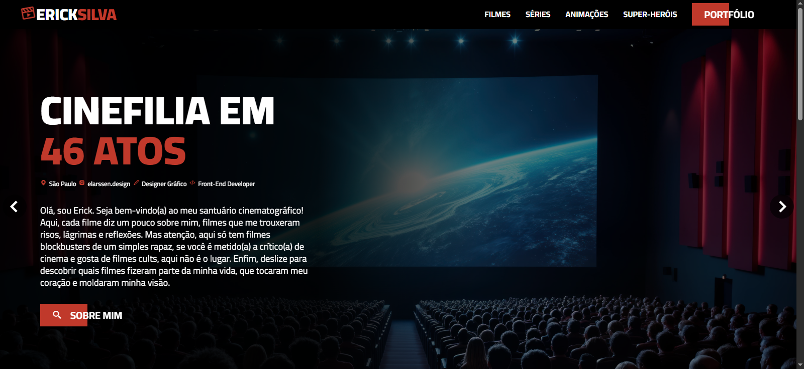

# 🎬 CinErick

Bem-vindo ao **CinErick**, um site desenvolvido para reunir e exibir os **filmes, séries, animações e personagens favoritos** do criador, em um formato interativo e organizado por **categorias e preferências pessoais**.  
Aqui, o cinema, a nostalgia se encontram em um só lugar!

---

## 🌟 Sobre o Projeto

O **CinErick** nasceu da ideia de compartilhar uma **visão pessoal e apaixonada** sobre o mundo do entretenimento.  
Cada página apresenta um tema específico, desde **super-heróis**, **vilões**, **animações**, até **filmes nostálgicos** e **lançamentos recentes**, tudo exibido em uma interface leve, visualmente agradável e fácil de navegar.

Além de um simples catálogo, o site também funciona como um **ranking pessoal**, mostrando os títulos em **ordem de preferência**, criando assim uma experiência única e personalizada.

---

## 🧩 Estrutura do Projeto

O site é composto por múltiplas páginas, cada uma dedicada a um tema:

- 🎞️ `index.html` — Página inicial com introdução ao projeto e a sessão de filmes favoritos  
- 🦸 `marvel.html` — Personagens favoritos do universo Marvel  
- 🦇 `dc.html` — Personagens favoritos do universo DC Comics  
- 🕶️ `anti-herois.html` — Anti-heróis favoritos e marcantes do cinema e das HQs  
- 💥 `viloes.html` — Ranking dos maiores vilões dos HQs  
- 🧊 `animacoes.html` — Ranking das animações favoritas  
- 📺 `series.html` — Ranking das séries que marcaram época  
- 🎬 `recentes.html` — Ranking do filmes e produções recentes  
- 🕰️ `nostalgia.html` — Ranking dos filmes clássicos que despertam memórias  
- 🧠 `herois-subestimados.html` — Ranking dos personagens que merecem mais reconhecimento  
- ⚔️ `equipes.html` — Ranking dos times lendários do cinema e quadrinhos  

---

## 💻 Tecnologias Utilizadas

O projeto foi desenvolvido com foco em **simplicidade, performance e estética**.  
As principais tecnologias utilizadas são:

- **HTML5** — Estrutura e semântica das páginas  
- **CSS3** — Estilização visual e layout responsivo  
  - Arquivos: `app.css` e `grid.css`  
- **JavaScript (ES6)** — Interatividade e efeitos dinâmicos  
  - Arquivo: `app.js`  
- **Imagens otimizadas** — Galeria rica com pôsteres, cenas e ícones  
- **Design responsivo** — Adaptável para telas de diferentes tamanhos  

---

## 🎨 Tema e Estilo

O **CinErick** combina **design moderno** com uma **atmosfera cinematográfica**.  
A paleta de cores e o layout foram pensados para destacar as imagens e facilitar a navegação entre as categorias, proporcionando uma **experiência imersiva** para o usuário.

Cada página é única, mas mantém uma identidade visual coerente, reforçando a ideia de um verdadeiro **universo de filmes**.

---

## 🚀 Como Executar o Projeto

1. Faça o download do repositório:
   ```bash
   git clone https://github.com/SEU-USUARIO/cinerick.git
   ```

2. Acesse a pasta do projeto:
   ```bash
   cd cinerick
   ```

3. Abra o arquivo principal:
   ```bash
   index.html
   ```

4. Navegue pelas páginas e aproveite o catálogo cinematográfico!

---

## 📁 Estrutura de Pastas

```
cinerick/
│
├── index.html
├── app.css
├── grid.css
├── app.js
├── /images        → Galeria de pôsteres e imagens temáticas
├── /animacoes.html
├── /dc.html
├── /marvel.html
├── /series.html
├── /viloes.html
├── /nostalgia.html
└── ... e outras páginas temáticas
```

---

## 📸 Prévia Visual

> 

---

## 💡 Futuras Melhorias

- [ ] Adicionar sistema de busca por título  
- [ ] Criar modo escuro (dark mode)  
- [ ] Implementar transições e animações em JavaScript  
- [ ] Inserir novas categorias (diretores, trilhas sonoras, etc.)  

---

## 👨‍🎨 Autor

**Erick Silva**  
🎥 Designer Gráfico, Animador e Programador Front-end  
📍 Diadema - SP, Brasil  

📸 [Instagram](https://instagram.com/elarssendesign)  
💼 [Portfólio Profissional](https://ericksilva.space)

---

## 🏷️ Licença

Este projeto é de uso pessoal e educativo.  
Você pode explorá-lo, estudá-lo e se inspirar, mas lembre-se de dar os devidos créditos ao autor.

---

> _"O cinema é uma arte que nos faz sentir mil vidas em uma só."_ 🎞️  
> — CinErick
